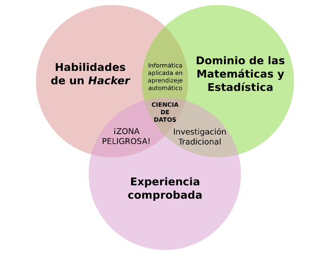

# ¿Que es ciencia de Datos?

Se encuentra en la interseccion de las habilidades de Hacking (OS,Python, Base de Datos, R, etc), Matematica(Algebra lineal, Vectores, etc), Negocio (Conocimiento del Negocio).

Data Science, toma parte del Machine Learning (Modelos)

## 1. Tipo de Datos: 

## 2. Exploracion de Datos (EDA)

Encontrar patrones relevantes en la data sin modificacion

## 3. Preproccesing

* Limpieza, depuracion de datos
* Transformacion de los datos

## 3.1. PreProccesing con Python

### 3.1.1. Python Ecosystem

* El creador es Van russel 
* Beneficios:

### 3.2. PreProccesing Issues

* Inconsistencias en data 
	* Por ejemplo, En columnas de Edad, donde se espera un rango determinado Entero, se podria encontrar negativos, 400 años, etc.
	* Inconsistencias por Tipo de Datos
		* Se espera Entero, pero viene Strings
		* Esperas tipo de datos Date y viene datos tipo Float

* Imputacion de Datos
	
	* Datos Nulos (NaN): 
		* Dependiendo de cantidad de Nulls en filas y columnas se deberian de eliminar
		* Dependiendo de la variable y su distribucion, para imputar podria ponerse el valor de una media o mediana de la variable
		* Algo mas sofistifacado podria hacerse un modelo para imputar datos (KNN, por ejemplo)

* Escalamiento
* Normalización

