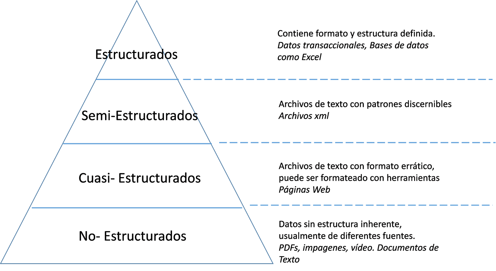

# ¿Que es ciencia de Datos?

Se encuentra en la interseccion de las habilidades de Hacking (OS,Python, Base de Datos, R, etc), Matematica(Algebra lineal, Vectores, etc), Negocio (Conocimiento del Negocio).

Data Science, toma parte del Machine Learning (Modelos)

[Imagen1](Imagenes/ciencia-de-datos.png)

## Tipo de Datos: 

## Exploracion de Datos (EDA)

Encontrar patrones relevantes en la data sin modificacion

## Preproccesing

* Limpieza, depuracion de datos
* Transformacion de los datos

## PreProccesing con Python

### Python Ecosystem

* El creador es Van russel 
* Beneficios:

